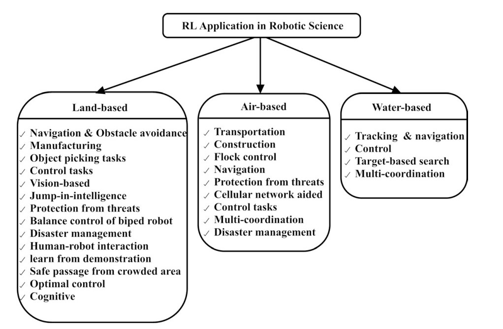

#   Reinforcement learning in robotic applications: a comprehensive survey
##  Introduction
RL is the sub-field of ML. ML can be classified into three parts:  
+ Supervised Learning: use labeled dataset to supervise the   algorithms to make the robot able to classify data or predict outcomes accurately  
+ Unsupervised Learning: algorithms can find the hidden pattern in the unlabeled dataset without intervention from supervisors  
+ Reinforcement Learning / RL: where an agent learns through interaction with the environment  

## Overview of RL
### Development of RL
For the monkey, the striatum (纹状体) would take actions. The cortex (大脑皮层) would recieve the signals from striatum and select them. After the action is completed, the Dopamine neurons (多巴胺神经) would evaluate the reward prediction error (RPE). The RPE is the difference between the experience output and the output from staiatum. The RPE would be used to correct the following actions. The Rescorla-Wagner equation is shown in Equation 1, the RPE is shown in Equation 2, the TD rule which extend by the Equation 1 is shown in Equation 3.  
$$
\begin{aligned}
& w_i (t+1) = w_i (t) + \gamma (r(t) - w_i (t)) &(1)\\
&RPE = r(t) + w_i (t) &(2)\\
&w_i(s_t) \leftarrowtail w_i (t_s) + \gamma ((r(t) - w_i (t_s)+\lambda w_i(t_{s+1})) &(3)\\
\end{aligned}
$$  
The Equation 1 is the summary of the learning process. $\gamma$ is the learning parameter, $\lambda$ is the discount rate for future estimates of values. The TD rule is not important for further work. 

### Development of RL
Optimal policy defined which actions are needed in curent states. The agents learn the optimal policy by interact with the environment.  
Markov Decision Process formulism (MDP) is a five tuple, which are shown as below:  

+ $S$: the set of states,
+ $A$: the set of actions,
+ {$P_{sa}$}: state transition posibility,
+ $R$: reward function,
+ $\lambda$：dicount factor. $\lambda \in [ 0, 1 )$ 

The expect return over policy of the MDP can be expressed as 
$$
\begin{aligned}
&Q^{\pi}(s,a) = E\begin{Bmatrix} 
{\sum^{\infty}_{j=0}\lambda^j*r_{t+j+1}|s_t = s, a_t = a} 
\end{Bmatrix}
\end{aligned}
$$  
In the lecture given by Enda Wu, an example of robot moving on a 3x4 map is given to explain the MDP formalism. The map is shown as below.

|       |   1   |   2   |   3   |   4   |
| :---: | :---: | :---: | :---: | :---: |
|   3   | -0.02 | -0.02 | -0.02 |   1   |
|   2   | -0.02 |///////| -0.02 |  -1   |
|   1   | -0.02 | -0.02 | -0.02 | -0.02 |

"///////" is an obstacle. The destination is block (4,3). The robot will start from block (1,1)
+ $S$: . 11 states.            
+ $A$: {East, West, South, North} 
+ {$P_{sa}$}: When give a command to the robot, there is 0.8 chance of successfully go the way you told it and 0.1 chance that it will accidentally veer off tothe left or right.  
    > $P_{(3,1)N}((3,2)) = 0.8$  
    > $P_{(3,1)N}((2,1)) = 0.1$  
    > $P_{(3,1)N}((2,1)) = 0.1$  
    > $P_{(3,1)N}(others) = 0.0$
+ $R$：The destination has the positive reward $R(4,3) = 1$. We hope that robot do not pass block(4,2) so $R(4,2) = -1$. we want to shorten the distance so $R(others) = -0.02$
+ $\lambda$: usually slightly smaller than 1, in this example is 0.99. On one hand, the discount factor is used to shrink the time that the robot reach the destination. On the other hand, the discount factor encourage the robot to reach block (4,2) as late as possible.
+ $PAYOFF_{total} = \sum^{\infty}_{i=0} \lambda^iR(s_i)$. The payoff has a bound value with dicount factor.  

### Basic RL algorithms

## Application
RL Application in Robotic Science  

****
### Water-based Robot
The water-based robot mainly refers to the underwater vehicle. The underwater vehicles can be seperated into three types, which are HOV (载人潜水器), ROV (有缆遥控机器人), and AUV (自治水下机器人). Some research institutions use ARV (自主/遥控水下机器人) which combines the ROV with AUV. Owing to the limitation of robot, we do not need to take the application about water-based robot into acount.  
****
### Air-based Robot
Applications: surveillance, disaster management, real-time communication, multi-coordination operations
+ **Safety problem:** Protection from threats.  
  >use Deep Q learning to enable the UAVs to keep operating while they are attacked by unknown dynamic attacker model.
+ **Application of specific problems:** Transportation delivery, Flock control, and Disaster management. $\bigotimes$  
  >These applications involve specific areas. The transportation delivery may be a good choice for us if possible.
+ **Kinematic Constraints:** Construction, Multi-coordination.  $\bigotimes$  
  >Use the RL to solve the problem of multi-robots coordination
+ **Obstacle Avoidance:** Navigation, Control tasks. $\bigotimes$   
  >Navigation $\rightarrowtail$ dynamic environment  
  >Control tasks $\rightarrowtail$ stochastic environment  
+ **Cellular network aided:**
  >real-time sensing with UVAs to serve as aerial bases for the ground station for efective communication.  

*Marked with the "$\bigotimes$" is the research direction that I think is relatively feasible*
****

### Land-based Robot
+ **Navigation and Obstacle Avoidance** $\bigoplus$  
  >Navigation of the robot in a dynamic environment is a great challenge. The following thechniques are used to realise the navigation and obstacle avoidance:  
  >*<u>Fuzzy logic</u>, <u>RL</u>, <u>Q-learning</u>, PGRL, DRL, neur-control, RAOFC, NN (NN, Deep NN, RNN), Reservoir computing, PN-DQN, Quantum inspired RL (QiRL), neuro-evolution, Idiotpic-AIS network*  

  >**Safe passage from crowded area**: This is related to the obstacle avoidance. The safe passage is obstacle avoidance in dynamic environment.

+ **Industry application**
  >Manufacturing: replace people in dangerous working environment  
  >Object picking tasks: help people moving objects

+ **AI**
  >Jump in the intelligence of robot: use RL combined with different learning methods.  
  >Protection from threats: protect AI systems from attack.

*Marked with the "$\bigoplus$" is the research direction that I think is relatively feasible*